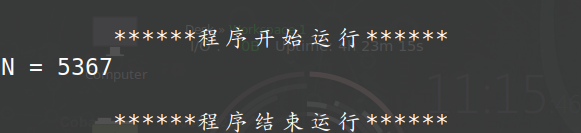
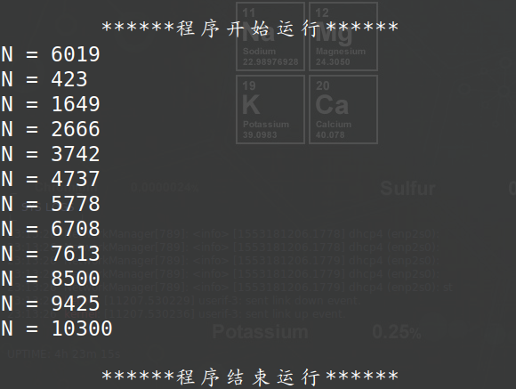
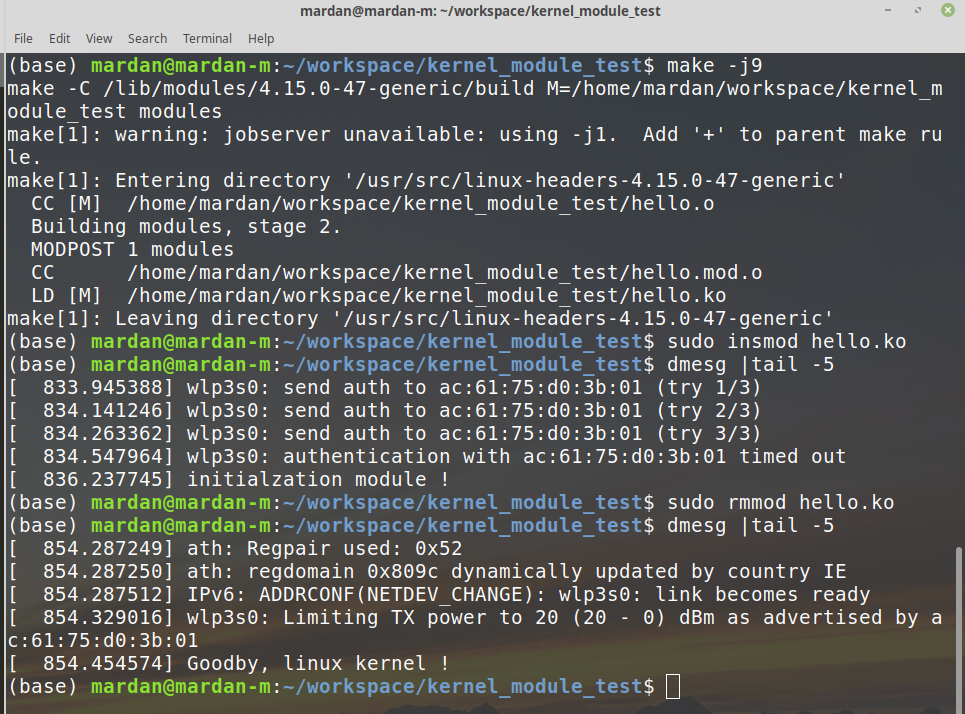

## Question

1、程序A和B以不同的速度运行出现的情况：

> 1）N=N+1，在print(N)和N=0之前运行，即执行次序：N=N+1 <font color="red">n+1</font> print(N) <font color="red">n+1</font> N=0 <font color="red">0</font>
>
> 2）N=N+1，在print(N)和N=0之后执行，即执行次序：print(N) <font color="red">n</font> N=0 <font color="red">0</font> N=N+1 <font color="red">1</font>
>
> 3）N=N+1，在print(N)和N=0之间执行，即执行次序：print(N) <font color="red">n</font> N=N+1 <font color="red">n+1</font> N=0 <font color="red">0</font>

2、用Linux的消息队列机制编程实现生产者-消费者问题

3、在Linux系统中实现一个可加载的内核模块，里面至少包含一个内核线程

## Answer

- 1、代码(Code)

  ```c
  #include <stdio.h>
  #include <stdlib.h>
  #include <pthread.h>
  
  int N;
  void* aa(void);
  void* bb(void);
  
  void print(char* log) {
  	printf("%s\n", log);
  }
  
  int main(int argc, char const* argv[])
  {
  	pthread_t thread1, thread2;
  	//线程1
  	if (pthread_create(&thread1, NULL, (void*)& aa, NULL) != 0) {
  		print("线程--->1 创建失败");
  		exit(1);
  	}
  	if (pthread_create(&thread2, NULL, (void*)& bb, NULL) != 0) {
  		print("线程--->2 创建失败");
  		exit(1);
  	}
  
  	void* result;
  	if (pthread_join(thread1, &result) != 0)
  	{
  		print("线程--->1无法加入队列");
  		exit(1);
  	}
  	if (pthread_join(thread2, &result) != 0)
  	{
  		print("线程--->2无法加入队列");
  		exit(1);
  	}
  	return 0;
  }
  
  void* aa(void) {
  	for (int i = 0; i < 100000; i++)
  	{
  		N++;
  	}
  	return NULL;
  }
  void* bb(void) {
  	for (int i = 0; i < 100000; i++)
  	{
  		if (N != 0)
  		{
  			printf("N = %d\n", N);
  		}
  		N = 0;
  	}
  	return NULL;
  }
  ```

- 1、结果(Result)

  

  

- 2、代码(Code)

- 2、结果(Result)

- 3、代码(Code)

  **my_kernel_module.c**

  ```c
  #include <linux/init.h>
  #include <linux/module.h>
  #include <linux/kernel.h>
  
  MODULE_LICENSE("Anti 996");
  MODULE_AUTHOR("Mardan M");
  MODULE_DESCRIPTION("a simple class homework test");
  MODULE_VERSION("0.1");
  
  
  static int __init kernel_init(void){
  	printk("initialzation module !\n");
  	return 0;
  }
  
  static void __exit kernel_exit(void){
  	printk("Goodby, linux kernel !\n");
  }
  
  module_init(kernel_init);
  module_exit(kernel_exit);
  ```

  **Makefile**

  ```makefile
  obj-m += my_kernel_module.o
  
  all:
  	make -C /lib/modules/${shell uname -r}/build M=${PWD} modules
  
  clean:
  	make -C /lib/modules/${shell uname -r}/build M=${PWD} clean
  ```

- 3、结果(Result)

  > 编译（make）
  >
  > 载入模块（sudo insmod hello.ko）
  >
  > 载出模块（sudo rmmod hello.ko）
  >
  > 查看内核调式信息（dmesg |tail -5）

**如下图：**

